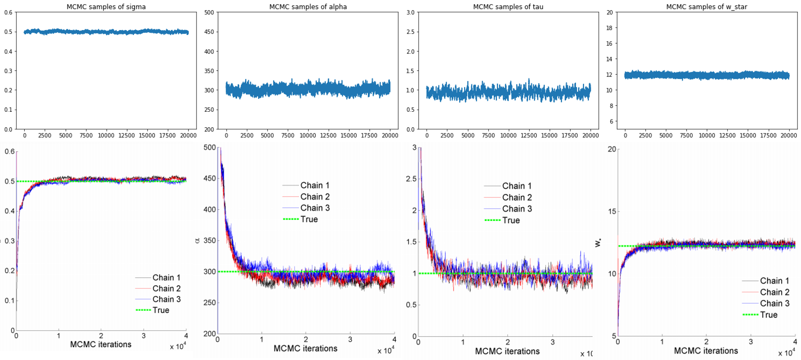
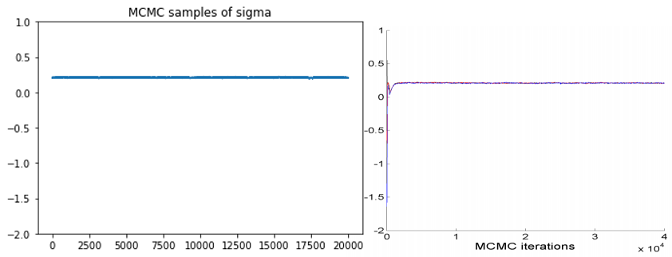

# Sparse graphs using exchangeable random measures

## Goal of the project

To the best of my knowledge, there is no python code related this paper.

So the goal of this project is to naively reproduce the paper in python.

I mainly referred [SNetOC](https://github.com/misxenia/SNetOC), for debugging, testing and details about not indicated part in the paper, especially, [GGP_sampling](https://github.com/leequant761/Sparse-graphs-using-exchangeable-random-measures/blob/main/rnd.py)

## For beginner, recommended materials to understand this paper

* Kingman : Poisson processes 3. Oxford University Press, USA.
* Pitman : Poisson-Kingman partitions. Lecture Notes-Monograph Series 1–34.
* Devroye : Random variate generation for exponentially and polynomially tilted stable distributions
* Peter Orbanz and Sinead Williamson : Unit-rate Poisson representations of completely random measures
* Gunter Last and Mathew Penrose : Lectures on the Poisson Process

In my opinion, the above list is a efficient material to understand this paper.

## Expected Schedule

Inference part (until 12/14)

1. HMC algorithm
2.  Metropolis Hastings algorithm
3. Exponentially tilted stable$(\alpha)$ sampling

Experiment (until 12/21)

7.1. Simulated data

7.2. Testing for sparsity of real-world graphs

## Implementation

We burned 10000 samples and take thinning with 2

### 7.1. Simulation

```
python main.py --dataset=simul
```



We got exactly same MCMC samples with the paper

### 7.2. Testing for sparsity of real-world graphs

#### [Enron-email network](http://snap.stanford.edu/data/email-Enron.html)

```
python main.py --dataset=email
```



We got exactly same MCMC samples with the paper

---

#### [USAirport](http://opsahl.co.uk/tnet/datasets/USairport_2010.dl)


We got different MCMC samples with the paper. It needs to be examined, as soon as possible.
